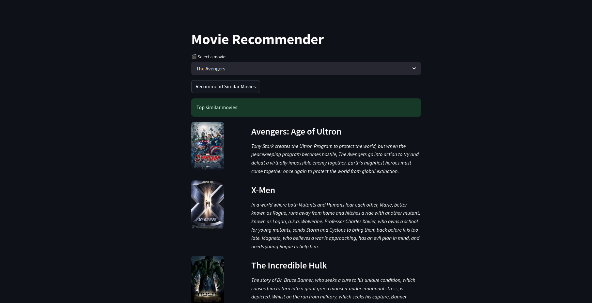

# 🎬 Content-Based Movie Recommender System

A sleek, content-based movie recommender system that suggests similar movies based on genres, keywords, and overviews. The application features a web interface built with **Streamlit** and enhances recommendations by fetching real-time posters and plots using the **OMDb API**.

🔗 **Live Application:** [Movie Recommender System on Render](https://movie-recommender-system-o6fq.onrender.com/)

---

##  Demo Preview

Below is a preview of the deployed website displaying movie recommendations, plots, and posters:



---

##  Key Features

* **Content-Based Filtering:** Uses TF-IDF Vectorization and Cosine Similarity to find movies with similar genres, keywords, and storylines.
* **Interactive Web Interface:** Clean and responsive UI powered by Streamlit, offering search capabilities and clear layouts.
* **Real-time API Integration:** Dynamically fetches movie poster images and detailed plot summaries from the **OMDb API** to enrich recommendations.
* **Robust NLP Pipeline:** Cleans dataset text using Natural Language Toolkit (NLTK) by removing stopwords, punctuation, and performing tokenization.
* **Precomputed Matrices:** Serializes preprocessed data and similarity matrices using `joblib` for immediate, low-latency recommendations.

---

##  Technology Stack

* **Frontend Framework:** [Streamlit](https://streamlit.io/)
* **Machine Learning & NLP:** [Scikit-learn](https://scikit-learn.org/), [NLTK](https://www.nltk.org/)
* **Data Manipulation:** [Pandas](https://pandas.pydata.org/), [NumPy](https://numpy.org/)
* **Data Serialization:** [Joblib](https://joblib.readthedocs.io/)
* **APIs & Networking:** [Requests](https://requests.readthedocs.io/), [OMDb API](http://www.omdbapi.com/)
* **Environment Management:** `python-dotenv`

---

##  Project Structure

```text
├── .env                  # Environment variables (API Keys)
├── README.md             # Project documentation (this file)
├── main.py               # Streamlit application (main entry point)
├── omdb_utils.py         # Utility functions to call OMDb API
├── preprocess.py         # Text preprocessing and similarity matrix generation
├── recommend.py          # Core recommendation engine logic
├── requirements.txt      # List of dependencies
├── scrrenshot.png        # Screenshot of the deployed app
├── start_app.txt         # Startup reference commands
└── movies.csv            # Source movies dataset (raw metadata)
```

---

##  Setup & Installation

Follow these steps to run the project locally:

### 1. Clone the Repository
```bash
git clone https://github.com/itsLordAnurag/Movie-Recommender-System.git
cd Movie-Recommender-System
```

### 2. Set Up a Virtual Environment (Optional but Recommended)
```bash
python3 -m venv myenv
source myenv/bin/activate  # On Windows use: myenv\Scripts\activate
```

### 3. Install Dependencies
```bash
pip install -r requirements.txt
```

### 4. Configure OMDb API Key
1. Get a free API key from [OMDb API](http://www.omdbapi.com/apikey.aspx).
2. Create a file named `.env` in the root directory.
3. Add your API key as follows:
   ```env
   OMDB_API_KEY=your_api_key_here
   ```

### 5. Run Preprocessing (To Generate Models)
If the `.pkl` models are not present or you want to retrain the system with updated dataset values, run the preprocessing script:
```bash
python3 preprocess.py
```
This generates:
* `df_cleaned.pkl`: Preprocessed dataframe.
* `tfidf_matrix.pkl`: Transformed text vectors.
* `cosine_sim.pkl`: Cosine similarity matrix.

### 6. Run the Streamlit App
To start the application server:
```bash
streamlit run main.py
```

---

## How It Works

1. **Text Combination:** The genres, keywords, and overview columns from the dataset are concatenated into a single metadata block for each movie.
2. **Text Cleaning & NLP:** Non-alphabetic characters are removed, the text is lowercased, tokenized, and English stopwords are filtered out.
3. **TF-IDF Vectorization:** The words are converted into a numeric matrix of TF-IDF features (up to 5,000 top features).
4. **Cosine Similarity:** A similarity score matrix is computed using the dot product of normalized TF-IDF vectors.
5. **Recommendation Query:** When a movie is selected, the application looks up its index, retrieves its similarity scores with all other movies, sorts them in descending order, and displays the top 5 highest-scoring matches along with live details from OMDb.

---
